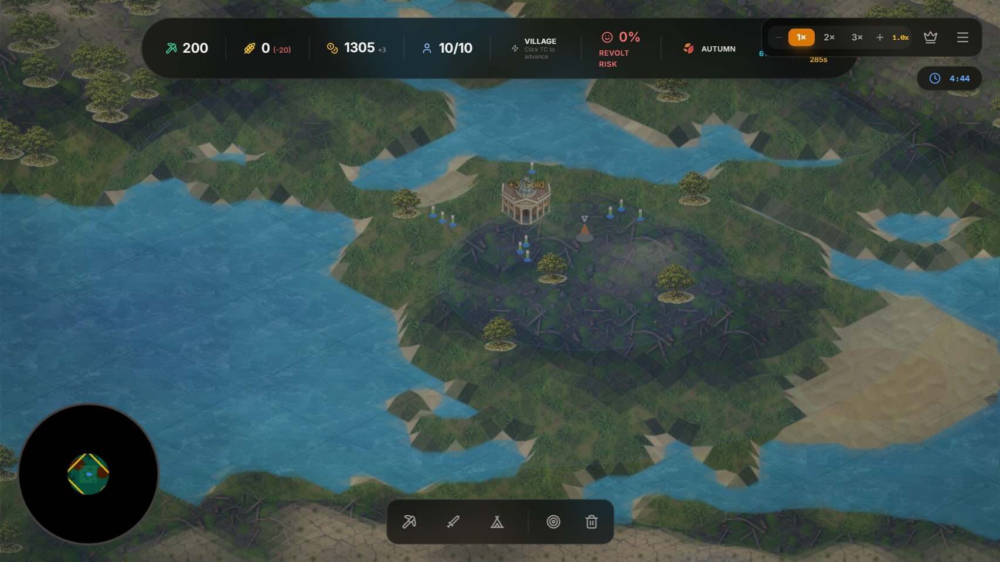
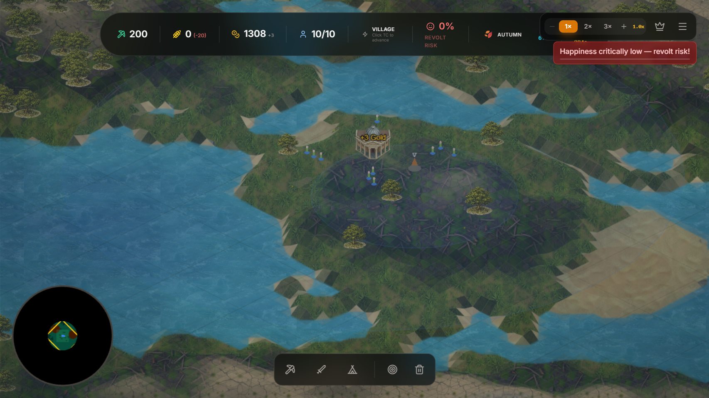
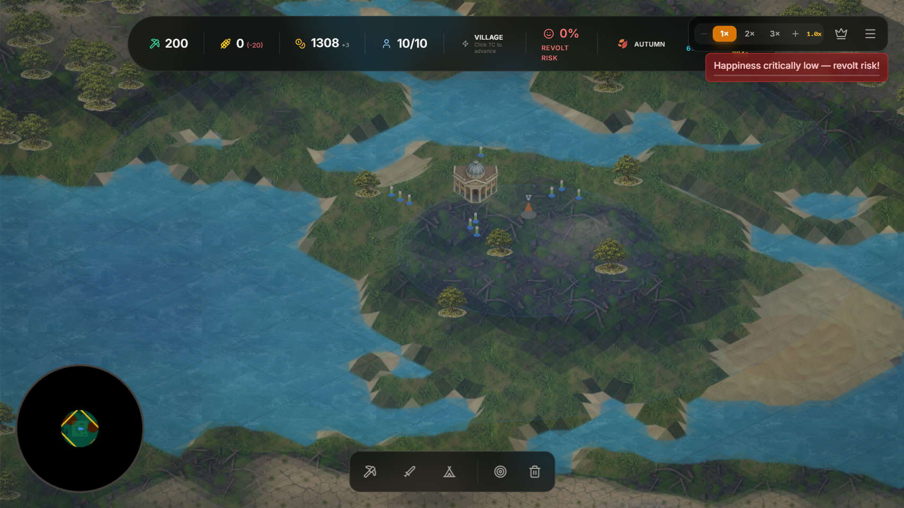

# CivStrategy Visual Gap Audit — vs Age of Empires II: Definitive Edition

**Date:** 2026-08-05  
**Sprint:** Phase 1 — Visual Fidelity Baseline  
**Bar:** Age of Empires II: DE  
**Auditor:** VisualAuditor

---

## Executive Summary

CivStrategy renders a functional isometric RTS but sits at **2/5 visual fidelity** against AoE II: DE. Terrain tiling is immediately visible, water is flat/untextured, units are primitive shapes, buildings lack architectural detail, and atmospheric effects are absent. UI is clean but generic. All six Phase 2 work items from WORKBENCH.md are directly enabled by closing these gaps.

**Priority ranking:** (atmospheric effects CONFIRMED IMPLEMENTED — NOT a blocker)
1. Terrain texture/tiling (blocks elevation work) — Critical / Large
2. Water rendering (shoreline + animation queued in Phase 2) — High / Medium
3. Unit sprite detail — High / Large
4. Building shading/detail — Medium / Medium
5. UI polish (MainMenu Hermes already in progress) — Low-Medium / Small

---

## Domain 1: Terrain Rendering

### Screenshots

### Current Quality: 2/5

**Gaps vs AoE II: DE:**
1. **Texture tiling visible** — Ground tiles repeat clearly every ~8–12 hexes. AoE II uses hand-painted terrain with noise breaks and edge blending.
2. **Limited biome variation** — Only 5 terrain keys (sand/grass/forest/scrub/stone). AoE II has savanna, snow, desert, dirt path, shallow water, etc.
3. **No elevation shading** — Flat color per tile; no slope-based lighting or height-based tint variation (pending `toIsoElev` work).
4. **Grid lines visible** — Faint white hex outlines overlay terrain. AoE II hides grid beneath texture.

**Priority:** Critical  
**Effort:** Large  
**Rationale:** Terrain is 60–70% of screen time. Tiling breaks immersion immediately. Elevation wire-up (`feat/terrain-elevation`) depends on vertex lifting working cleanly on existing tiles — fix texture base first.

**Specific improvements:**
- Increase `TEX_PERIOD` from 256 → 768 (already discovered in lessons learned) and re-bake tiles
- Add 2–3 noise layers per biome for albedo variation
- Implement slope-based shading via `applyVisualTinting` using vertex normals
- Mask grid lines outside editor/debug mode

---

## Domain 2: Water Rendering

### Screenshots

### Current Quality: 1/5

**Gaps vs AoE II: DE:**
1. **Solid flat blue** — Water is single-color fill with no transparency or depth variation. AoE II uses multi-tone blue with specular highlights.
2. **No shoreline transition** — Hard edge between land and water. AoE II has beach/sand strip, wave foam, and gradient fade.
3. **No wave animation** — Static surface. AoE II: DE has animated waves, ripples, and shoreline breakers.
4. **No underwater terrain** — Water is opaque; AoE II shows drowned terrain detail beneath surface.

**Priority:** High  
**Effort:** Medium  
**Rationale:** Water System is queued in Phase 2. Shoreline waves + foam + glint are already on the list. Interior calm zones and throttled `drawWater` (~50ms) are planned. Closing this gap unblocks the queued work.

**Specific improvements:**
- Implement marching-squares shoreline clipping (already in memory as planned approach)
- Add multi-sine CPU wave animation (current code has this but needs tuning)
- Add foam sprites along shore edges
- Lower wave amplitude on interior calm zones
- Add subtle transparency + depth tint

---

## Domain 3: Units

### Screenshots

### Current Quality: 1/5

**Gaps vs AoE II: DE:**
1. **Primitive geometry** — Units rendered as tiny colored cylinders/blocks. AoE II has detailed sprites with armor, weapons, and faction-specific design.
2. **No animation** — Static placement; no walk/idle/attack cycles. AoE II: DE has fluid sprite-sheet animations.
3. **No squad rendering** — Units overlap without formation spacing. AoE II uses tight squad formations with collision avoidance.
4. **No selection highlights** — Green ring exists on buildings but units lack hover/click feedback.

**Priority:** High  
**Effort:** Large  
**Rationale:** Units are the player's primary interaction point. 1000+ unit stress test (Phase 3) will expose LOD/culling issues if sprites are heavy, but current primitive shapes mean visual upgrade is separate from performance optimization.

**Specific improvements:**
- Replace cylinder meshes with sprite-sheet renders (use `gen-sprites.ts` pipeline)
- Add idle/walk/attack animation states per unit type
- Implement squad formation spacing (circular/line)
- Add selection ring + health bar above unit
- Add LOD: simplified sprite at distance, detailed up close

---

## Domain 4: Buildings

### Screenshots

### Current Quality: 2/5

**Gaps vs AoE II: DE:**
1. **Flat shading** — Buildings use single texture with no dynamic shadow or ambient occlusion. AoE II has per-pixel lighting and directional shadows.
2. **Limited architectural detail** — Town Center is recognizable but lacks column details, roof texture variation, siege damage states.
3. **No construction progress** — Buildings appear complete. AoE II shows scaffolding and partial construction.
4. **No shadow casting** — Units/buildings cast no shadows on terrain. AoE II: DE has crisp unit shadows.

**Priority:** Medium  
**Effort:** Medium  
**Rationale:** Buildings are fewer than units/terrain tiles, so draw call impact is lower. Architectural detail upgrade can happen in parallel with terrain.

**Specific improvements:**
- Add normal maps to building sprites for per-pixel lighting
- Implement construction progress overlay (scaffold + incomplete texture)
- Add directional shadow sprites beneath buildings (cheaper than real-time shadow maps)
- Add destruction/damage states per building type
- Add garrison glow/selection state

---

## Domain 5: Atmospheric Effects — CONFIRMED IMPLEMENTED

### Screenshots

### Current Quality: 3/5 (revised — bloom, vignette, clouds, seasonal tints active)

**Confirmed implemented (verified in `systems/AtmosphericSystem.ts`):**
- Bloom: `setupBloom()` — adaptive 0.2–0.8 strength with UI slider
- Vignette: `addVignette(0.5, 0.5, 0.98, 0.03)` — subtle edge fade
- Clouds: 20 animated cloud sprites, alpha 0.03–0.07, scale 4–8x
- Seasonal tints: per-season terrain overlay, transitions between seasons
- Bloom pulses: MeatGrinderEffect triggers brief bloom pulses on combat

**Remaining gaps vs AoE II: DE:**
1. **Ambient particles** — No dust motes, leaves, embers, or weather particles. AoE II has ambient particle systems.
2. **Soft-edge fog of war** — Functional black mask lacks AoE II's gradient reveal animation and exploration fade.
3. **Distance-based terrain desaturation** — No atmospheric perspective fade for distant terrain.

**Priority:** NOT A BLOCKER — already functional  
**Effort:** Small remaining work  
**Rationale:** Core atmospheric effects confirmed active. Remaining gaps (particles, fog-of-war gradient, distance fade) are polish items, not blockers. Deprioritized.

**Specific remaining improvements:**
- Add ambient particles: dust motes (dry), leaves (summer), snow (winter)
- Enhance fog-of-war with soft-edge radial gradient mask + exploration reveal
- Add distance-based terrain desaturation (simple shader or tint LUT)

---

## Domain 6: UI Polish

### Screenshots

### Current Quality: 3/5

**Gaps vs AoE II: DE:**
1. **Font mismatch** — Main menu uses serif (Cinzel-style) but in-game HUD uses generic sans-serif. AoE II uses consistent medieval serif throughout.
2. **Generic resource icons** — Simple geometric icons (pickaxe, wheat). AoE II uses detailed hand-drawn faction-specific icons.
3. **Flat HUD panels** — Translucent dark rectangles. AoE II has stone/metal textured panels with beveled edges.
4. **No tooltip system** — Hovering icons shows nothing. AoE II has detailed tooltips with stats and flavor text.
5. **Minimap too simple** — Circular black border with flat colors. AoE II has terrain texture on minimap and fog-of-war reveal.

**Priority:** Low–Medium  
**Effort:** Small–Medium  
**Rationale:** MainMenu Hermes (40.9KB) already shipped with GSAP crossfade and FACTION_PHENOTYPE dye. In-game HUD is functional but generic. UI polish is last in Phase 2 priority because it doesn't block gameplay.

**Specific improvements:**
- Replace in-game HUD font with Cinzel or similar medieval serif
- Add beveled border style to HUD panels (CSS `border-image` or Phaser graphics)
- Add tooltip system on hover (show building/unit stats)
- Enhance minimap with terrain tint and soft fog reveal
- Add faction-specific icon reskin per civ selection

---

## Performance–Visual Tradeoffs

| Visual Feature | Est. FPS Cost | Mitigation |
|----------------|---------------|------------|
| Terrain normal maps | Low | Bake into tile atlas |
| Water animation | Medium | Throttle to 50ms (already planned) |
| Unit sprite sheets | Medium | LOD + sprite pooling |
| Building shadows | Low | Static shadow sprites |
| Bloom post-process | Medium | Half-resolution pass |
| Particle systems | High | Throttle count by zoom level |

---

## Artifact Index

| Screenshot | Domain | Purpose |
|------------|--------|---------|
| `assets/screenshots/01-mainmenu.png` | UI | Main menu baseline |
| `assets/screenshots/02-gamesetup.png` | UI | Game setup screen |
| `assets/screenshots/03-ingame-initial.png` | Atmosphere | Initial spawn view |
| `assets/screenshots/04-terrain-overview.png` | Terrain/Units | Wide terrain + unit clusters |
| `assets/screenshots/05-water-overview.png` | Water | Shoreline edge detail |
| `assets/screenshots/06-forest-detail.png` | Terrain | Forest density and tree rendering |
| `assets/screenshots/07-buildings-base.png` | Buildings | Town Center architecture |
| `assets/screenshots/08-ui-hud.png` | UI | In-game HUD layout |

All screenshots: 1706x960, captured 2026-08-05 on main branch, Large River Valley map, seed 0.

---

## Next Steps (Mapped to WORKBENCH.md)

1. **Terrain:** Fix TEX_PERIOD tiling first (small), then wire up `toIsoElev` vertex lift (medium)
2. **Water:** Implement marching-squares shoreline + foam sprites (medium)
3. **Units:** Source/replace sprite assets via `gen-sprites.ts` pipeline (large)
4. **Atmosphere:** Add CSS vignette + bloom overlay (small), then particles (medium)
5. **UI:** Swap in-game font to Cinzel, add tooltips (small)

All Phase 2 items are directly enabled by this gap inventory. Terrain and water gaps are critical because they block the queued elevation and water polish work.
